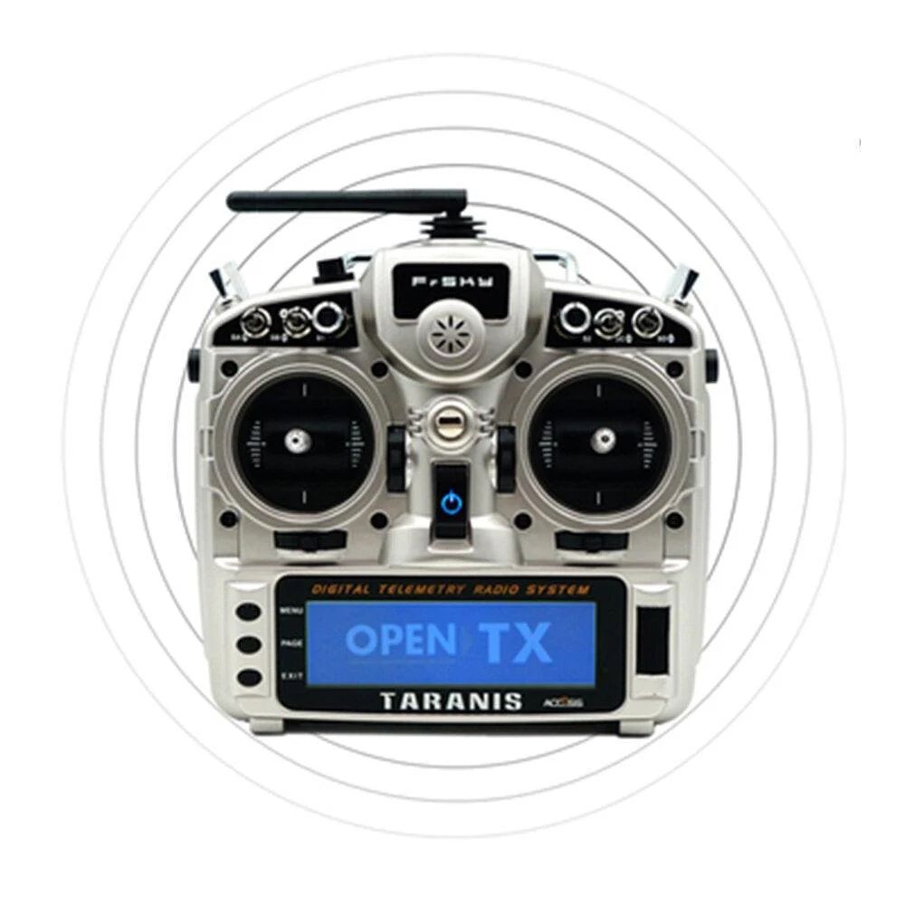
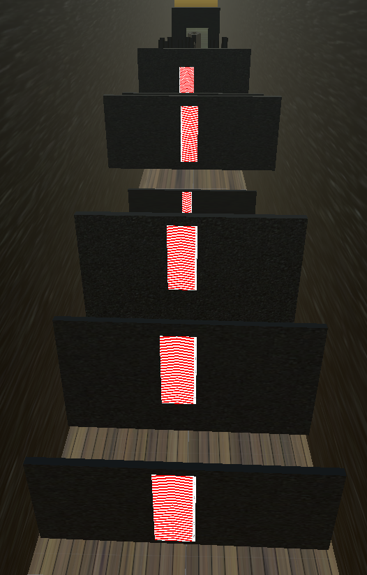
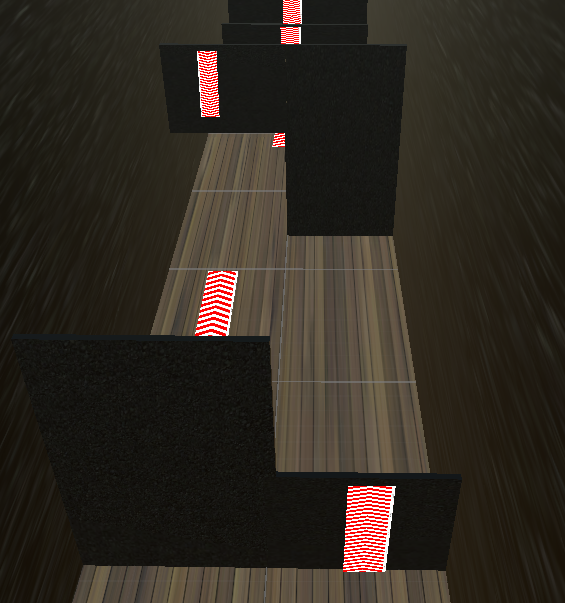
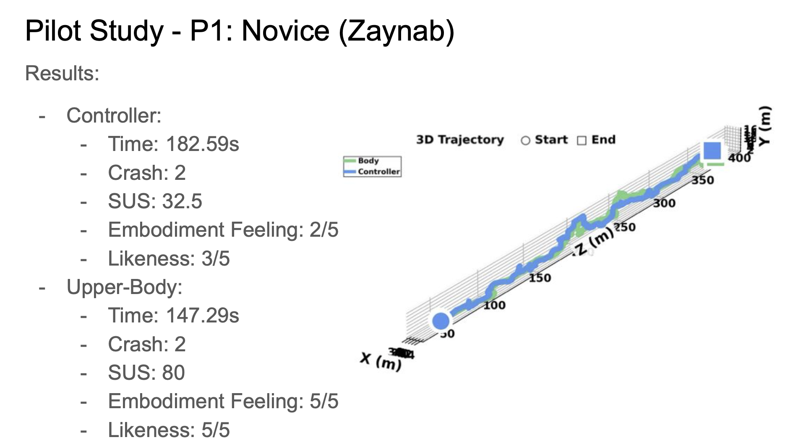
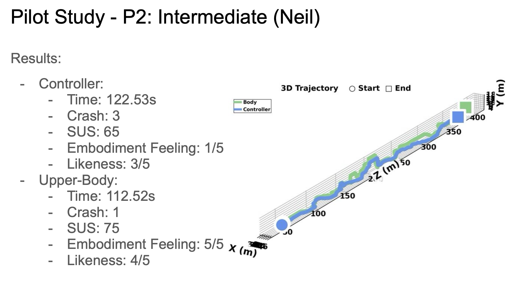
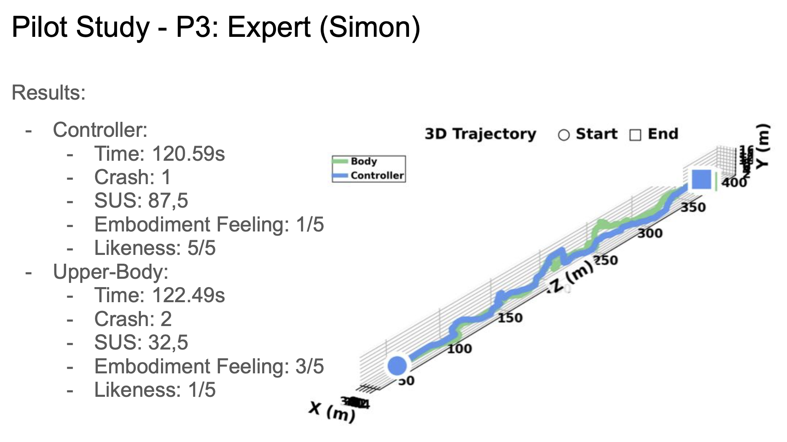
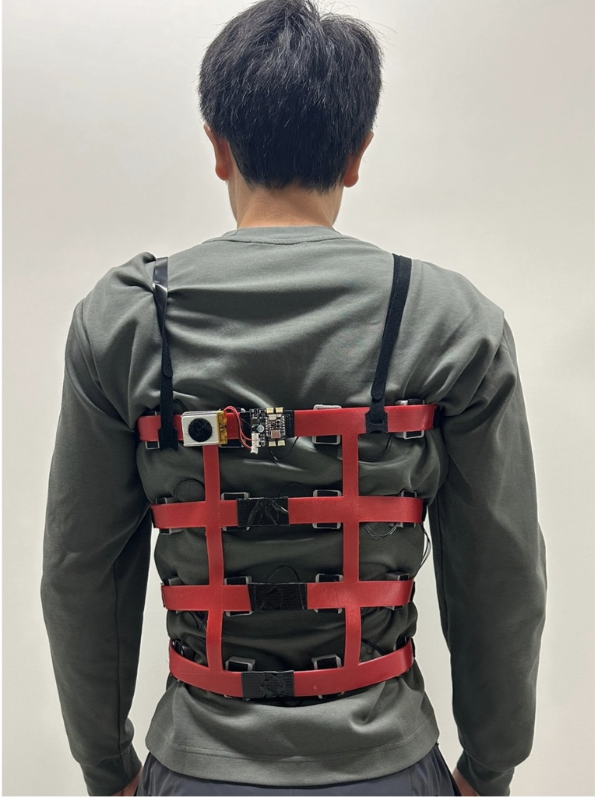

# SwarmControl

SwarmControl is a VR research project comparing two methods of controlling a drone swarm. The study investigates how the input modality affects **task performance** and the **sense of embodiment** experienced by the operator.


---

## Motivation

Traditional drone swarm control relies on RC controllers, which require learning an abstract mapping between physical inputs and swarm behaviour. There is no natural correspondence between what the operator does and how the swarm moves — control is distal and cognitively mediated.

Body-based interfaces exploit **motor congruence**: leaning forward moves the swarm forward, spreading the arms spreads the swarm. This direct mapping reduces the cognitive gap between intention and action, and should strengthen the sense of being part of the swarm rather than operating it from the outside. Adding haptic feedback closes the sensorimotor loop further, giving the operator a physical awareness of swarm state (collisions, disconnections, forces).

---

## Research Questions & Hypotheses

**RQ1** — Does body-based control improve the sense of embodiment compared to traditional RC control?
> **H1:** The Upper Body condition will yield higher embodiment scores, driven by motor congruence between operator movement and swarm movement.

**RQ2** — Does body-based control affect task performance?
> **H2:** The Upper Body condition will achieve comparable or better performance (time, crashes, connectivity) for non-expert users. Expert users may favour the controller due to prior learned mappings.

**RQ3** — Does haptic feedback enhance embodiment and performance independently of control modality?
> **H3:** Haptic feedback will increase embodiment scores regardless of condition, by reinforcing the physical presence of the swarm.
---

## Conditions

| | Controller | Upper Body |
|---|---|---|
| **Hardware** | Taranis RC transmitter | Chest IMU + forearm IMUs + Meta Quest |
| **Movement** | Right stick (XZ) | Chest pitch/roll |
| **Height** | Left stick (throttle) | Forearm IMU |
| **Spread** | Right knob | Forearm IMU |
| **Camera** | Left stick (yaw) | Meta Quest headset yaw |

> Meta Quest hand tracking is used to correct IMU drift in the Upper Body condition.




---

## Task Path

The path is a linear obstacle course (~400 m) that systematically tests all control axes. Obstacles are ordered to isolate and then combine input modalities:

1. **Left / Right** — lateral navigation gates
2. **Spread / Contract** — obstacles requiring swarm radius adjustment
3. **Height** — vertical clearance obstacles

4. **Combined** — multi-axis obstacles requiring simultaneous control of movement, spread, and height


---

## Measured Outcomes

**Performance**

- Task completion time
- Drones lost (obstacle collisions)
- Swarm network connectivity (proportion of drones in main connected cluster, 0–1)
- Swarm isolation events (drones disconnected per frame)

**Usability & Embodiment**

- SUS (System Usability Scale)
- Embodiment feeling (1–5 self-report)
- Likeness rating (1–5 self-report)

**Haptics** (counterbalanced factor)

- Wrist-worn ESP32 actuator nodes deliver feedback on obstacle, network, force field, and crash events
- All haptic events are time-stamped in the data log

---

## Previous Pilot Study (N = 3)

Three participants across experience levels completed both conditions. Results suggest the Upper Body condition consistently improves embodiment, while performance trends vary with expertise.

| Participant | Condition | Time (s) | Crashes | SUS | Embodiment | Likeness |
|---|---|---|---|---|---|---|
| P1 — Novice | Controller | 182.6 | 2 | 32.5 | 2/5 | 3/5 |
| | Upper Body | 147.3 | 2 | 80 | 5/5 | 5/5 |
| P2 — Intermediate | Controller | 122.5 | 3 | 65 | 1/5 | 3/5 |
| | Upper Body | 112.5 | 1 | 75 | 5/5 | 4/5 |
| P3 — Expert | Controller | 120.6 | 1 | 87.5 | 5/5 | 5/5 |
| | Upper Body | 122.5 | 2 | 32.5 | 3/5 | 1/5 |

**Key observations:**

- Upper Body yields higher embodiment scores for novice and intermediate users
- Expert users showed higher usability with the Controller, suggesting a learning curve for the body-based interface
- Completion time and crash count are comparable or better with Upper Body for non-expert users





---

## System Architecture

```
SwarmControl/
├── SoundMapping/SoundMappingUnity/   # Unity VR application — simulation, input fusion, data logging
├── Control/                          # Python hand-tracking server (MediaPipe, WebSocket → Unity)
└── WebPages/unity-plotter/           # Haptic bridge (Unity → Python → USB → ESP32 → actuators)
```
---

## Next Steps

Integrate full upper-body haptic feedback via a wearable haptic jacket, combining IMU-based swarm control with distributed haptic actuation across the torso — enabling closed-loop sensorimotor control of the swarm.

